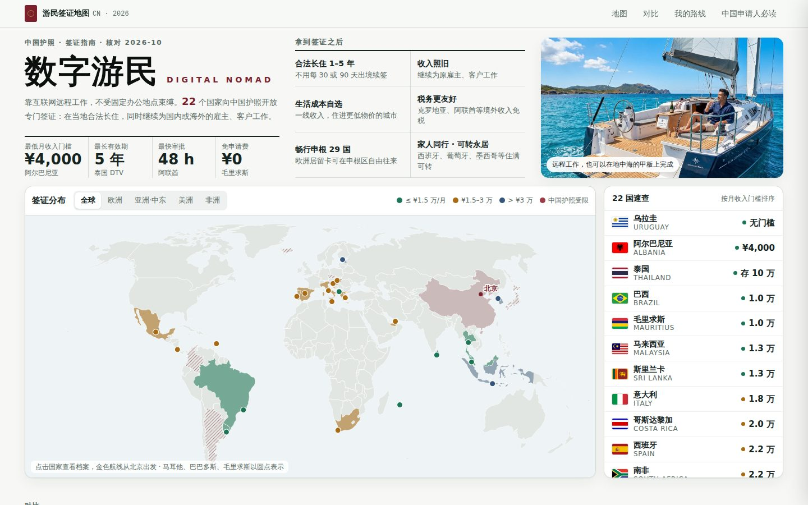

# 数字游民签证指南（中国护照版）

面向中国护照持有人的数字游民签证地图与申请指南。整理了 22 个向中国护照开放的数字游民签证，包括分布地图、门槛对比、国家档案、申请步骤、费用和官方入口；另列出 5 个热门但暂不对中国护照开放的项目。

**在线演示：<https://wanhsu61.github.io/digital-nomad-visa-guide/>**

## 网站功能

- **签证分布地图**：真实国界世界地图，按月收入门槛分三档着色。可切换欧洲、亚洲·中东、美洲、非洲视图，点击国家打开档案，并画出从北京出发的航线。
- **22 国速查榜**：按月收入门槛从低到高排序，鼠标移到某一行，地图同步高亮该国。
- **国旗卡片对比**：按地区筛选，按门槛、费用、停留时长、审批速度排序。卡片上用大号字标出签证缩写（DTV、D8、E33G 等）。
- **国家档案**：顶部是迷你世界地图，目标国家标红。内容分概览、达成条件、申请方法、申请费用四页，附官方入口和资料来源。
- **我的路线**：选一个国家作为目标，生成通用准备和该国申请步骤的勾选清单，进度保存在当前浏览器里。
- **中国申请人必读**：无犯罪记录证明与海牙认证、给中国公司远程工作能否算境外收入、换汇额度、183 天税务规则、入境签证、常见拒签原因。
- 所有金额按汇率自动换算成**人民币约数**，同时保留官方原币金额，方便核对。

## 22 国一览

点击国家名查看该国完整 README。

<!-- INDEX:START -->
| 地区 | 国旗 | 国家 | 签证 | 月收入门槛（约） | 有效期 | 门槛等级 |
|---|---|---|---|---|---|---|
| [欧洲](countries/europe/README.md) |  | [阿尔巴尼亚 Albania](countries/europe/albania/README.md) | UP | ¥4,000 | 1 年，可连续续签 5 次 | 入门门槛 |
| [欧洲](countries/europe/README.md) |  | [意大利 Italy](countries/europe/italy/README.md) | DNV | ¥1.8 万 | 1 年，可无限次续签 | 中等门槛 |
| [欧洲](countries/europe/README.md) |  | [西班牙 Spain](countries/europe/spain/README.md) | DNV | ¥2.2 万 | 境内申请 3 年卡，可续 2 年 | 中等门槛 |
| [欧洲](countries/europe/README.md) |  | [匈牙利 Hungary](countries/europe/hungary/README.md) | White Card | ¥2.3 万 | 1 年，可续 1 年（最长 2 年） | 中等门槛 |
| [欧洲](countries/europe/README.md) |  | [希腊 Greece](countries/europe/greece/README.md) | DNV | ¥2.7 万 | 签证 1 年，转居留许可 2 年可续 | 中等门槛 |
| [欧洲](countries/europe/README.md) |  | [马耳他 Malta](countries/europe/malta/README.md) | NRP | ¥2.7 万 | 1 年一续，最长 4 年 | 中等门槛 |
| [欧洲](countries/europe/README.md) |  | [克罗地亚 Croatia](countries/europe/croatia/README.md) | DN | ¥2.8 万 | 一次性最长 18 个月 | 中等门槛 |
| [欧洲](countries/europe/README.md) |  | [葡萄牙 Portugal](countries/europe/portugal/README.md) | D8 | ¥2.8 万 | 首张居留卡 2 年，之后每次续 3 年 | 中等门槛 |
| [欧洲](countries/europe/README.md) |  | [爱沙尼亚 Estonia](countries/europe/estonia/README.md) | DNV | ¥3.4 万 | 最长 1 年 | 高门槛 |
| [亚洲 · 中东](countries/asia-middle-east/README.md) |  | [泰国 Thailand](countries/asia-middle-east/thailand/README.md) | DTV | 存款 ¥10 万 | 5 年多次入境，每次停留 180 天，可延 180 天 | 入门门槛 |
| [亚洲 · 中东](countries/asia-middle-east/README.md) |  | [马来西亚 Malaysia](countries/asia-middle-east/malaysia/README.md) | DE Rantau | ¥1.3 万 | 12 个月，可续 12 个月 | 入门门槛 |
| [亚洲 · 中东](countries/asia-middle-east/README.md) |  | [斯里兰卡 Sri Lanka](countries/asia-middle-east/srilanka/README.md) | DNV | ¥1.3 万 | 1 年，每年可续 | 入门门槛 |
| [亚洲 · 中东](countries/asia-middle-east/README.md) |  | [阿联酋（迪拜） UAE](countries/asia-middle-east/uae/README.md) | RWV | ¥2.4 万 | 1 年，可续 | 中等门槛 |
| [亚洲 · 中东](countries/asia-middle-east/README.md) |  | [印度尼西亚 Indonesia](countries/asia-middle-east/indonesia/README.md) | E33G | ¥3.4 万 | 1 年（到期需重新申请） | 高门槛 |
| [亚洲 · 中东](countries/asia-middle-east/README.md) |  | [韩国 South Korea](countries/asia-middle-east/korea/README.md) | F-1-D | ¥4.3 万 | 最长 3 年（1 年 + 两次延期） | 高门槛 |
| [美洲](countries/americas/README.md) |  | [乌拉圭 Uruguay](countries/americas/uruguay/README.md) | ND | 无门槛 | 6 个月，可续 1 次 | 入门门槛 |
| [美洲](countries/americas/README.md) |  | [巴西 Brazil](countries/americas/brazil/README.md) | VITEM XIV | ¥1 万 | 1 年，可续 1 年 | 入门门槛 |
| [美洲](countries/americas/README.md) |  | [哥斯达黎加 Costa Rica](countries/americas/costarica/README.md) | DNV | ¥2 万 | 1 年，可再续 1 年 | 中等门槛 |
| [美洲](countries/americas/README.md) |  | [巴巴多斯 Barbados](countries/americas/barbados/README.md) | Welcome Stamp | ¥2.8 万 | 12 个月，可续 | 中等门槛 |
| [美洲](countries/americas/README.md) |  | [墨西哥 Mexico](countries/americas/mexico/README.md) | RT | ¥3 万 | 首年 1 年卡，可续至 4 年，之后转永居 | 中等门槛 |
| [非洲 · 印度洋](countries/africa-indian-ocean/README.md) |  | [毛里求斯 Mauritius](countries/africa-indian-ocean/mauritius/README.md) | Premium | ¥1 万 | 最长 1 年，可续 | 入门门槛 |
| [非洲 · 印度洋](countries/africa-indian-ocean/README.md) |  | [南非 South Africa](countries/africa-indian-ocean/southafrica/README.md) | RWV | ¥2.2 万 | 最长 3 年 | 中等门槛 |
<!-- INDEX:END -->

门槛等级：入门 ≤ ¥1.5 万/月，中等 ¥1.5–3 万/月，高门槛 > ¥3 万/月。只要求存款的国家（泰国）按存款 ÷ 12 计算。

## 暂不对中国护照开放

<!-- BLOCKED:START -->
| 国家 | 原因 |
|---|---|
| 日本 | 数字游民签证仅限与日本互免签证且有税收协定的国家/地区，中国大陆护照不在名单。 |
| 捷克 | 数字游民项目限定澳、加、日、韩、新、英、美等少数国籍。 |
| 阿根廷 | 面向免签入境阿根廷的国籍，中国护照需签证，无法走该通道。 |
| 哥伦比亚 | V 类游民签证面向免签国籍，中国申请人需走其他签证类别。 |
| 冰岛 | 长期远程工作签证限申根免签国籍，中国护照不适用。 |
<!-- BLOCKED:END -->

## 数据说明

- 最近一次核对：2026 年 10 月 1 日。每个国家的资料来源列在各自 README 底部，汇总在 [research/sources.md](research/sources.md)。
- 人民币金额按 2026 年 9 月 30 日银行间中间价折算，详见 [research/exchange-rates.md](research/exchange-rates.md)。
- 签证政策经常调整，递交前请以各国官方入口为准。本项目不构成法律或税务意见。

## 致谢

- 国旗：[flagcdn.com](https://flagcdn.com/)
- 地图数据：[Natural Earth](https://www.naturalearthdata.com/) 与 [world-atlas](https://github.com/topojson/world-atlas)，投影使用 [d3-geo](https://github.com/d3/d3-geo)
